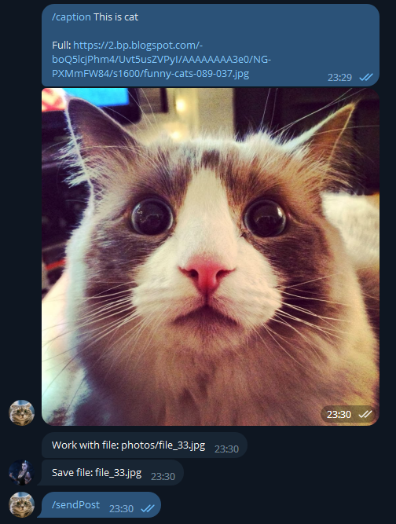
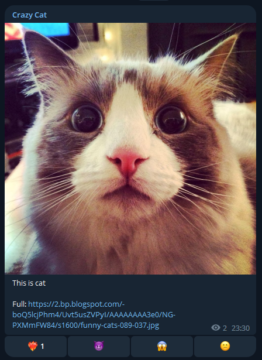

# 🤖 TelegramBot
Small project for learn etc. and actual skills.

 Art by Olena Yemelianova

## 🔗 Links
* [Docker HUB](https://hub.docker.com/repository/docker/marolok/telegram_bot/general)
* [GitHub](https://github.com/PavelBocharov/TelegramBot)

## 📚 Project stack
- Language - Java 17
- Framework - Spring Boot
- Build - [Apache Maven](https://maven.apache.org/)
- MQ
  - Local - [Apache Artemis MQ (Active MQ)](https://activemq.apache.org/components/artemis/)
  - Docker - [Apache Kafka](https://kafka.apache.org/)
- Image
  - Docker/Docker compose
  - Kubernetes
    - Classic [.yaml](https://kubernetes.io/docs/home/)
    - Maven - [Eclipse JKube](https://www.eclipse.org/jkube/)
- Cache
  - Local - [Ehcache](https://www.ehcache.org/)
  - Docker - [Redis](https://redis.io/)
- DataBase
  - Local - use cache
  - Docker - [TelegramDB](https://github.com/PavelBocharov/TelegramDB) (WebFlux + PostgreSQL)
- Configuration - [Spring Cloud Config](https://docs.spring.io/spring-cloud-config/docs/current/reference/html/). My image -> [DockerHub](https://hub.docker.com/repository/docker/marolok/telegram_conf/general)

## 🚀 Start application
### 🟢 Spring Boot application
1) Set environment in [application-local.yml](./src/main/resources/application-local.yml):
   - `application.bot.token` - Telegram Bot token
   - `application.bot.directory.path` - local directory for download files
   - `application.bot.admin.id` - admin ID for post (Use [IDBot](https://t.me/username_to_id_bot) for receive id.)
   - `application.group.chat.id` - chat ID for post (Use [IDBot](https://t.me/username_to_id_bot) for receive id.)
   - `application.group.chat.textLine` - last line for caption
2) Build and start project
   - IDEA - start `Main.main()`
   - Maven
     1) Compile jar - `mvn clean install`
     2) Start app - `java -jar ./target/TelegramBot*.jar`

### 🚢 Docker compose
0) [Start info](https://www.baeldung.com/ops/docker-compose)
1) Build JAR - `mvn clean install`
2) Set environment in [.env](./.env)
    - `LOCAL_PC_MOUNT_DIR` - local directory for download files
3) Set ENV in [docker-compose](./docker-compose.yml)
   - `tbotconf.GIT_URL` - your Git config (more [Spring Cloud Config](https://docs.spring.io/spring-cloud-config/docs/current/reference/html/))
   - `tbotconf.PRIVATE_KEY` - use SSH private key for connect (example [GitHub](https://docs.github.com/en/authentication/connecting-to-github-with-ssh/adding-a-new-ssh-key-to-your-github-account))
4) Set config in your Git repo ([TelegramConf](https://github.com/PavelBocharov/TelegramConf/blob/main/telegram-bot-image.yml), example [YAML](./src/main/resources/example.yaml))
5) Start - `docker compose up`
4) Stop - `docker compose down`

### ☸️ Kubernetes
* Install Kubernetes(Minikube) - **[LINK](https://kubernetes.io/ru/docs/setup/learning-environment/minikube/)**
* Start Minikube
  * First start 
    * `minikube start --mount-string="D:/temp/k8s:/mnt/tbot" --mount` - *"D:/temp/k8s"* your PC directory for TelegramBot data and PostgreSQL.
  * Other command
    * `minikube stop` - stop minikube
    * `minikube start` - start minikube (mount is automatic)
    * `minikube delete` - delete all data and minikube
    * `minikube dashboard` - start and open Kubernetes WebUI

#### 📗 Start with YAML
* Build docker image - `docker build -t marolok/telegram_bot:*.*.* .`
* Push docker image - `docker push marolok/telegram_bot:*.*.*`
* Set environment in [kube_conf.yaml](./k8s/kube_config.yaml) - check _"TelegramConf"_ block
  * `BOT_PROFILE` - application profile (need for application config filename, [Spring Cloud Config](https://docs.spring.io/spring-cloud-config/docs/current/reference/html/))
  * `GIT_URL` - your Git config (more [Spring Cloud Config](https://docs.spring.io/spring-cloud-config/docs/current/reference/html/))
  * `PRIVATE_KEY` - use SSH private key for connect (example [GitHub](https://docs.github.com/en/authentication/connecting-to-github-with-ssh/adding-a-new-ssh-key-to-your-github-account))
* Init config - `kubectl apply -f .\k8s\kube_config.yaml`
* Init PersistentVolume & PersistentVolumeClaim - `kubectl apply -f .\k8s\kube_pv.yaml`
* Start - `kubectl apply -f .\k8s\kube_pod.yaml`

#### 🚧 WIP 🏗️ Start with [JKube Maven Plugin](https://www.eclipse.org/jkube/) ⚠️NOT STABLE⚠️
* Set environment in [pom.xml](./pom.xml) - use mount target directory from `Start Minikube`
* Package application - `mvn clean package`
* Build Docker image - `mvn k8s:build`
* Create Kubernetes config file - `mvn k8s:resource`
* Start - `mvn k8s:apply`
  * You can use one command - `mvn clean package k8s:build k8s:resource k8s:apply`

## 🗺️ How to use
- Start chat with your Bot
- `Send text` - set file name for next file - [example](#-send-text-and-image)
- `Send file` - directory select by type file - [example](#-send-text-and-image)
  - _photos_ - jpg, jpeg, png, bmp
  - _videos_ - mp4
  - _gif_ - gif
  - _document_ -  non compress file
- `Send URL` - directory select by detected type
  - By MIME type - [example](#-send-url-with-mime-type)
  - If full path has type (_http://test.org/test.png_ -> photos)
    - `.gifv` by [imgur.com](https://imgur.com/) converted to `.mp4`
### 🐱 Send post
1) Send msg to bot - `/caption "your message with new line, URL and tags"`
2) Send photo or video (you can use URL)
3) If error you can repeat 1-2
4) For send post write `/sendPost`

|                   Work with bot                    |                       Result                       |
|:--------------------------------------------------:|:--------------------------------------------------:|
|  |  |

## 🎴 Screens
|                Send text and image                 |                 Send URL with MIME type                 |
|----------------------------------------------------|:-------------------------------------------------------:|
|  |       |

