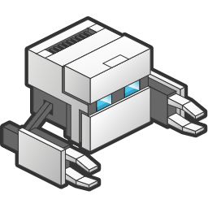
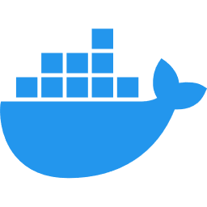

#  TelegramBot
Small project for learn etc. and actual skills.

##  Project stack
- Java 17
- Spring Boot
- Artemis MQ
- Docker/Docker compose
- Kubernetes
- Maven

##  Start application
###  Spring Boot application
1) Set environment in [application.properties](./src/main/resources/application.properties):
   - `application.bot.token` - Telegram Bot token
   - `application.bot.directory.path` - local directory for download files
2) Build and start project
   - IDEA - start `Main.main()`
   - Maven 
     1) Compile jar - `mvn clean install`
     2) Start app - `java -jar ./target/TelegramBot*.jar`
###  Docker compose
1) Set environment in [.env](./.env)
    - `LOCAL_PC_MOUNT_DIR` - local directory for download files 
    - `TELEGRAM_BOT_TOKEN` - Telegram Bot token
2) Start - `docker compose up`
3) Stop - `docker compose down`
###  Kubernetes
0) Install Kubernetes - **[LINK](https://kubernetes.io/ru/docs/setup/learning-environment/minikube/)**
1) Build docker image - `docker build -t marolok/telegram_bot:1.0.0 .`
1) Push docker image - `docker push marolok/telegram_bot:1.0.0`
2) Set environment in [kube_pod.yaml](./k8s/kube_pod.yaml)
2) Start - `kubectl apply -f .\k8s\kube_pod.yaml`
3) Stop - `kubectl delete pod telegram-bot`

##  How to use
- Start chat with your Bot
- `Send text` - set file name for next file - [example](#-send-text-and-image)
- `Send file` - directory select by type file - [example](#-send-text-and-image)
  - _photos_ - jpg, jpeg, png, bmp
  - _videos_ - mp4
  - _gif_ - gif
  - _document_ -  non compress file
- `Send URL` - directory select by detected type
  - By MIME type - [example](#-send-url-with-mime-type)
  - If full path has type (_http://test.org/test.png_ -> photos)
    - `.gifv` by [imgur.com](https://imgur.com/) converted to `.mp4`

##  Screens
#### ⚬ Send text and image

#### ⚬ Send URL with MIME type
