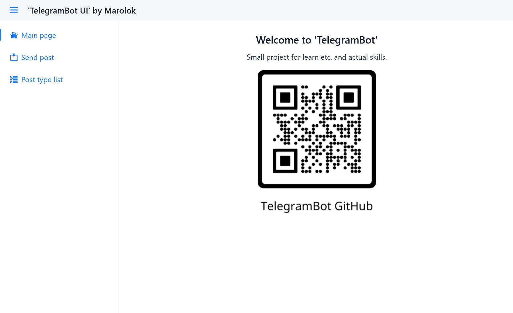
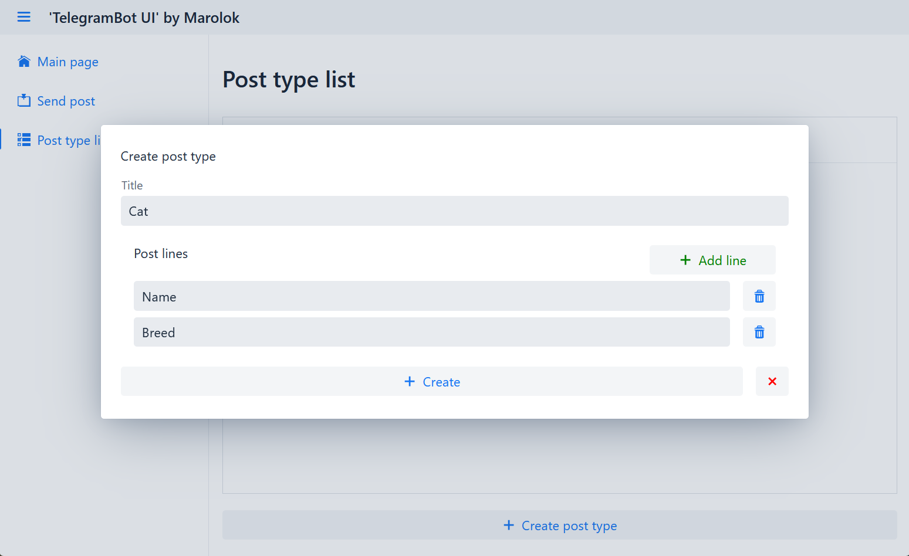
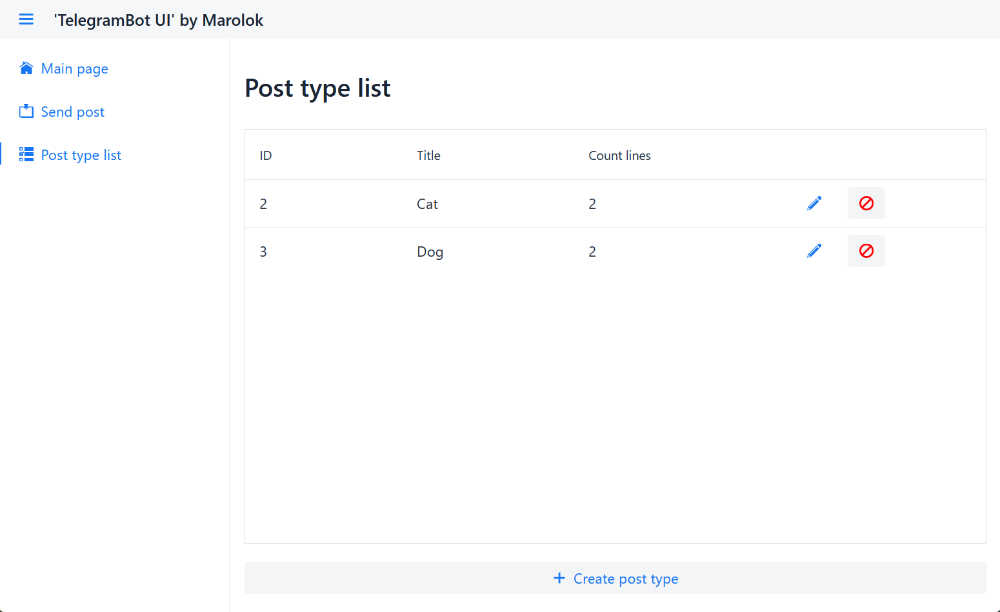
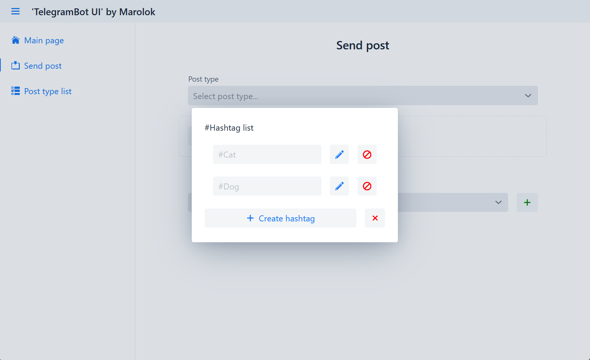
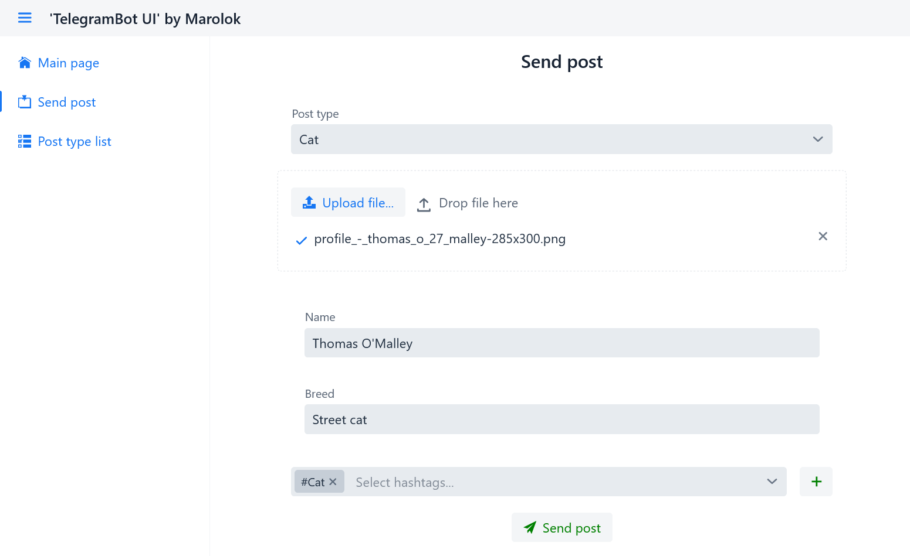
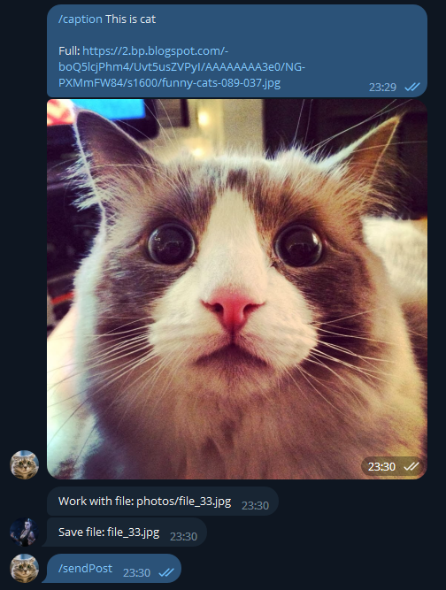
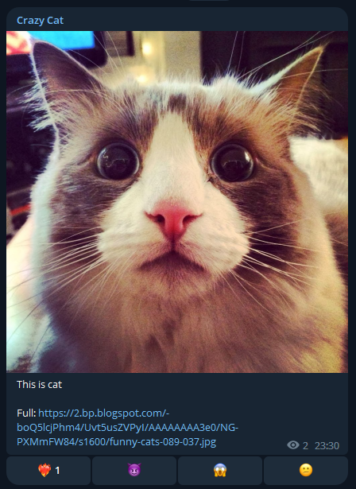
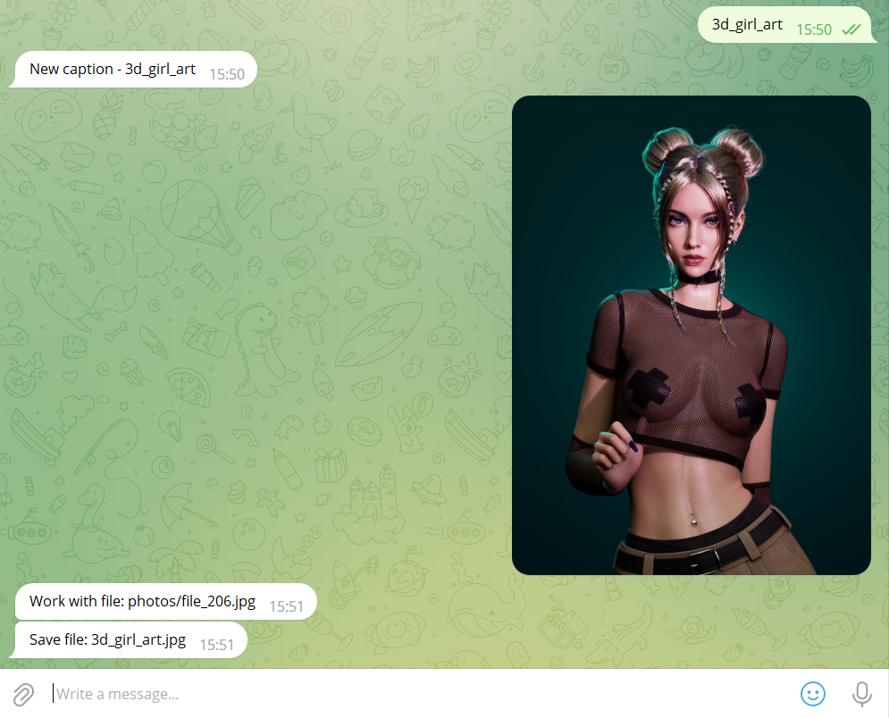
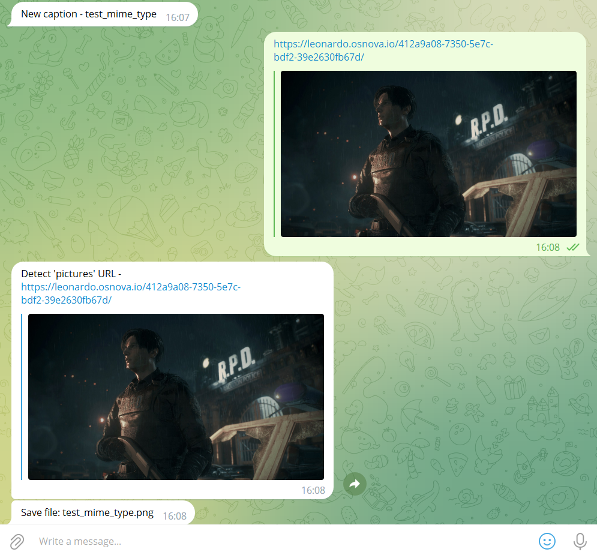

# 💾 How to use...

## 🔗 Links

1. [How to use UI](#-how-to-use-ui)
2. [How to use Telegram bot](#-how-to-use-telegram-bot)
3. [HOW to use local (Rest API)](#-rest-api-local-mod)

## ️💻 How to use UI

| Step by step                                                                                    |
|:------------------------------------------------------------------------------------------------|
| 1️⃣ Go to WEB-app                                                                               |
|                                         |
| 2️⃣ Create post type in `Post type list` page                                                   |
|                                         |
|                                         |
| 3️⃣ Create #Hashtags in 'Send post' page                                                        |
|                                         |
| 4️⃣ Select post type, upload file (MAX 10MB), write form and click 'Send post' button -> PROFIT |
|                                         |
|                                         |

## 🗺️ How to use Telegram bot

- Start chat with your Bot
- `Send text` - set file name for next file
- `Send file` - directory select by type file
    - _photos_ - jpg, jpeg, png, bmp
    - _videos_ - mp4
    - _gif_ - gif
    - _document_ - non compress file
- `Send URL` - directory select by detected type
    - By MIME type
    - If full path has type (_http://test.org/test.png_ -> photos)
        - `.gifv` by [imgur.com](https://imgur.com/) converted to `.mp4`

### 🐱 Send post in APP

1) Send msg to bot - `/caption "your message with new line, URL and tags"`
2) Send photo or video (you can use URL)
3) If error you can repeat 1-2
4) For send post write `/sendPost`

|                         Work with bot                          |                             Result                             |
|:--------------------------------------------------------------:|:--------------------------------------------------------------:|
|  |  |

## 👨🏼‍💻 REST API (local mod)

* Swagger-UI: [LINK](http://localhost:8080/webjars/swagger-ui/index.html#/)
* Send **POST** body `/post`:

| Field    | Type                | Required |                      Comment                      |
|:---------|---------------------|:--------:|:-------------------------------------------------:|
| rqUuid   | String              |    ✅     |                 Unique action ID.                 |
| rqTm     | Datetime (ISO)      |    ✅     |                  Time send msg.                   |
| userId   | Long                |    ✅     |      Admin ID. Only bot admin can send msg.       |
| filePath | String              |    ✅     | File path to send file. After send, file deleted. |
| caption  | Map<String, String> |    ❌     |      Caption line info -> `Title1 : line 1`       |
| hashTags | String[]            |    ❌     |                  Hashtag array.                   |

```json
{
  "rqUuid": "04d6895d-4b12-46e4-8c7f-2a69e0c6bbe6",
  "rqTm": "2024-02-24T15:59:29.968Z",
  "userId": 0,
  "filePath": "G:\\Cache\\dev\\dev_temp\\n2TMq-IJr3E.jpg",
  "caption": {
    "additionalProp1": "string",
    "additionalProp2": "string",
    "additionalProp3": "string"
  },
  "hashTags": [
    "string"
  ]
}
```

* Update msg **POST** body `/post/msg`:

| Field                            | Type           | Required |        Comment        |
|:---------------------------------|----------------|:--------:|:---------------------:|
| rqUuid                           | String         |    ✅     |   Unique action ID.   |
| rqTm                             | Datetime (ISO) |    ✅     |    Time send msg.     |
| msg                              | Object         |    ❌     |   Msg info in chat.   |
| msg.fromUserId                   | Long           |    -     |                       |
| msg.text                         | String         |    -     |                       |
| msg.chatId                       | Long           |    -     |                       |
| msg.photoSizeList.fileId         | String         |    -     |                       |
| msg.photoSizeList.fileSize       | Long           |    -     |                       |
| msg.documentFileId               | String         |    -     |                       |
| msg.videoFileId                  | String         |    -     |                       |
| msg.animationFileId              | String         |    -     |                       |
| callbackQuery                    | Object         |    ✅     |    Callback query     |
| callbackQuery.fromUserId         | Long           |    ✅     |   Who send callback   |
| callbackQuery.msgChatId          | Long           |    ✅     |    When - chat ID     |
| callbackQuery.messageId          | Long           |    ✅     |        Msg id         |
| callbackQuery.messageCaption     | String         |    -     |                       |
| callbackQuery.actionCallbackData | String         |    ✅     | fire, devil, 0_0, 0-0 |
| callbackQuery.videoFieldId       | String         |    -     |                       |
| callbackQuery.animationFieldId   | String         |    -     |                       |
| callbackQuery.photoFieldId       | String         |    -     |                       |
| callbackQuery.documentFieldId    | String         |    -     |                       |

```json
{
  "rqUuid": "04d6895d-4b12-46e4-8c7f-2a69e0c6bbe6",
  "rqTm": "2024-02-24T16:03:35.938Z",
  "msg": {
    "fromUserId": 0,
    "text": "string",
    "chatId": 0,
    "photoSizeList": [
      {
        "fileId": "string",
        "fileSize": 10485760
      }
    ],
    "documentFileId": "string",
    "videoFileId": "string",
    "animationFileId": "string"
  },
  "callbackQuery": {
    "fromUserId": 0,
    "msgChatId": 0,
    "messageId": 0,
    "messageCaption": "string",
    "actionCallbackData": "string",
    "videoFieldId": "string",
    "animationFieldId": "string",
    "photoFieldId": "string",
    "documentFieldId": "string"
  }
}
```

* Response body:

| Field     | Type           | Required |            Comment            |
|:----------|----------------|:--------:|:-----------------------------:|
| rqUuid    | String         |    ✅     |       Unique action ID.       |
| rqTm      | Datetime (ISO) |    ✅     |        Time send msg.         |
| errorCode | Long           |    ✅     |      Error code. 0 = OK.      |
| errorMsg  | String         |    ✅     | Error text, if errorCode > 0. |

```json
{
  "rqUuid": "04d6895d-4b12-46e4-8c7f-2a69e0c6bbe6",
  "rqTm": "2024-02-24T16:22:17.663Z",
  "errorCode": 0,
  "errorMsg": "string"
}
```

## 🎴 Screens

| Send text and image                                            |                    Send URL with MIME type                     |
|----------------------------------------------------------------|:--------------------------------------------------------------:|
|  |  |