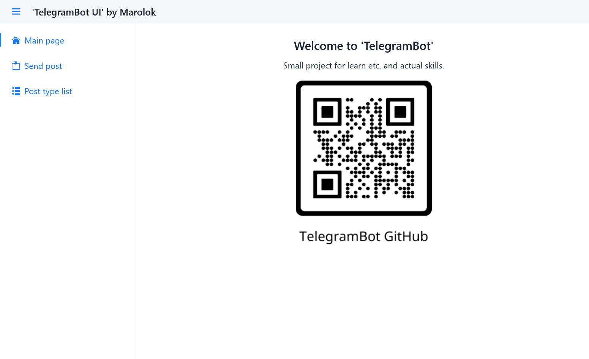
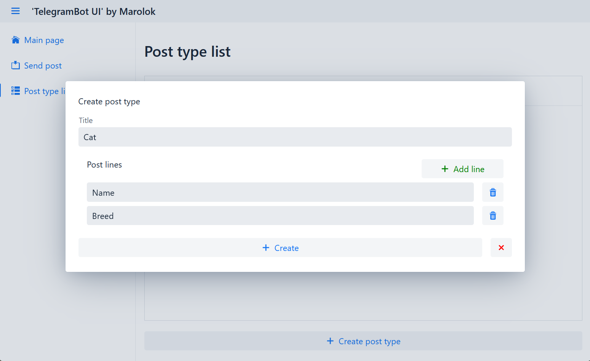
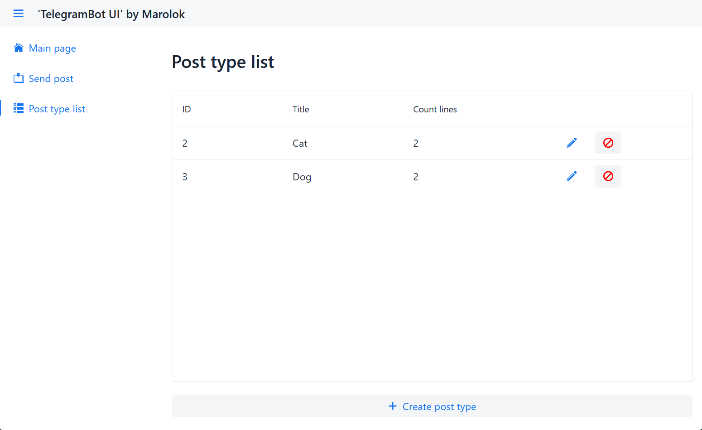
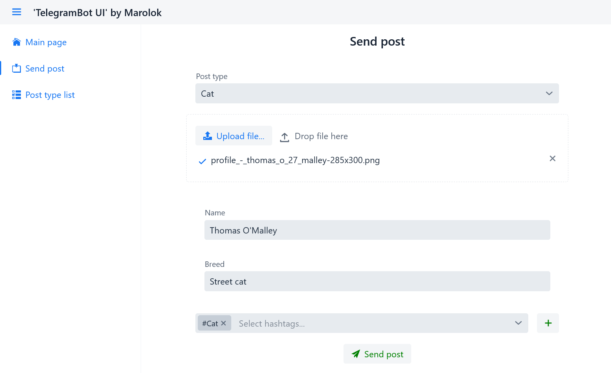
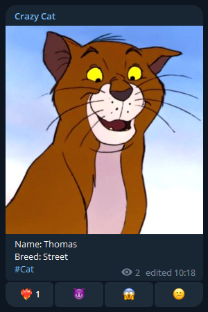

# 💾 How to use...

## 🔗 Links
1. [How to use UI](#-how-to-use-ui)
2. [How to use Telegram bot](#-how-to-use-telegram-bot)

## ️💻 How to use UI

| Step by step                                                                                    |
|-------------------------------------------------------------------------------------------------|
| 1️⃣ Go to WEB-app                                                                               |
|                                                    |
| 2️⃣ Create post type in `Post type list` page                                                   |
|                                                    |
|                                                    |
| 3️⃣ Create #Hashtags in 'Send post' page                                                        |
|                                                     |
| 4️⃣ Select post type, upload file (MAX 10MB), write form and click 'Send post' button -> PROFIT |
|                                                    |
|                                                    |

## 🗺️ How to use Telegram bot

- Start chat with your Bot
- `Send text` - set file name for next file - [example](#-send-text-and-image)
- `Send file` - directory select by type file - [example](#-send-text-and-image)
    - _photos_ - jpg, jpeg, png, bmp
    - _videos_ - mp4
    - _gif_ - gif
    - _document_ - non compress file
- `Send URL` - directory select by detected type
    - By MIME type - [example](#-send-url-with-mime-type)
    - If full path has type (_http://test.org/test.png_ -> photos)
        - `.gifv` by [imgur.com](https://imgur.com/) converted to `.mp4`

### 🐱 Send post

1) Send msg to bot - `/caption "your message with new line, URL and tags"`
2) Send photo or video (you can use URL)
3) If error you can repeat 1-2
4) For send post write `/sendPost`

|                    Work with bot                    |                       Result                        |
|:---------------------------------------------------:|:---------------------------------------------------:|
|  |  |

## 🎴 Screens

| Send text and image                                 |               Send URL with MIME type               |
|-----------------------------------------------------|:---------------------------------------------------:|
|  |  |