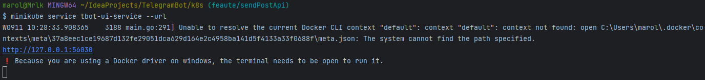

# 🚀 Start application
## 🔗 Links
* [🟢 Spring Boot application](#-spring-boot-application)
* [🚢 Docker compose](#-docker-compose)
* [☸️ Kubernetes](#-kubernetes)
* [🚧 WIP 🏗️ Start with JKube Maven Plugin - **⚠️NOT WORK⚠️**](#-wip--start-with-jkube-maven-plugin-not-work)

## 🟢 Spring Boot application
1) Set environment in [application-local.yml](../src/main/resources/application-local.yml):
    - `application.bot.token` - Telegram Bot token
    - `application.bot.directory.path` - local directory for download files
    - `application.bot.admin.id` - admin ID for post (Use [IDBot](https://t.me/username_to_id_bot) for receive id.)
    - `application.group.chat.id` - chat ID for post (Use [IDBot](https://t.me/username_to_id_bot) for receive id.)
    - `application.group.chat.textLine` - last line for caption
2) Build and start project
    - IDEA - start `Main.main()`
    - Maven
        1) Compile jar -
      ```bash 
      mvn clean install -U 
      ```
        2) Start app -
      ```bash
      java -jar ./target/TelegramBot*.jar
      ```
3) Integration test
    -  ⚠️Work after build project, because need jar-file for create test docker-image.
    - Start test:
   ```bash 
   mvn clean install -U 
   mvn test -Dtest="SendPost_IT" -Dskip.integration.test=false
   ```

## 🚢 Docker compose
0) [Start info](https://www.baeldung.com/ops/docker-compose)
1) Build JAR -
    ```bash
    mvn clean install -U
    ```
2) Set environment in [.env](../.env)
    - `LOCAL_PC_MOUNT_DIR` - local directory for download files
3) Set ENV in [docker-compose](../docker-compose.yml)
    - `tbotconf.GIT_URL` - your Git config (more [Spring Cloud Config](https://docs.spring.io/spring-cloud-config/docs/current/reference/html/))
    - `tbotconf.PRIVATE_KEY` - use SSH private key for connect (example [GitHub](https://docs.github.com/en/authentication/connecting-to-github-with-ssh/adding-a-new-ssh-key-to-your-github-account))
4) Set config in your Git repo ([TelegramConf](https://github.com/PavelBocharov/TelegramConf/blob/main/telegram-bot-image.yml), example [YAML](../src/main/resources/example.yaml))
5) Start -
    ```bash
    docker compose up
    ```
6) Stop -
    ```bash 
    docker compose down
    ```

## ☸️ Kubernetes
* Install Kubernetes(Minikube) - **[LINK](https://kubernetes.io/ru/docs/setup/learning-environment/minikube/)**
* Start Minikube
    * First start
        * Mount dir - *"D:/temp/k8s"* your PC directory for TelegramBot data and PostgreSQL.
      ```bash
      minikube start --mount-string="D:/temp/k8s:/mnt/tbot" --mount
      ```
        * Add Ingress
      ```bash
      minikube addons enable ingress
      ```
    * Other command
        * Stop minikube
          ```bash
          minikube stop
          ```
        * Start minikube (mount is automatic)
          ```bash
          minikube start
          ```
        * Delete all data and minikube
          ```bash
          minikube delete
          ```
        * Start and open Kubernetes WebUI
          ```bash
          minikube dashboard
          ```

### 📗 Start with YAML

```bash 
mvn clean install -U 
docker build -t marolok/telegram_bot:1.7.5 .
docker push marolok/telegram_bot:1.7.5
```

* Build docker image
  ```bash
  docker build -t marolok/telegram_bot:*.*.* .
  ```
* Push docker image
  ```bash
  docker push marolok/telegram_bot:*.*.*
  ```
* Set environment in [kube_conf.yaml](../k8s/kube_config.yaml) - check _"TelegramConf"_ block
    * `BOT_PROFILE` - application profile (need for application config filename, [Spring Cloud Config](https://docs.spring.io/spring-cloud-config/docs/current/reference/html/))
    * `GIT_URL` - your Git config (more [Spring Cloud Config](https://docs.spring.io/spring-cloud-config/docs/current/reference/html/))
    * `PRIVATE_KEY` - use SSH private key for connect (example [GitHub](https://docs.github.com/en/authentication/connecting-to-github-with-ssh/adding-a-new-ssh-key-to-your-github-account))
* Init config
  ```bash
  kubectl apply -f ./k8s/kube_config.yaml
  ```
* Init PersistentVolume & PersistentVolumeClaim
  ```bash
  kubectl apply -f ./k8s/kube_pv.yaml
  ```
* Deploy pods
  ```bash
  kubectl apply -f ./k8s/kube_pod.yaml
  ```
* Ingress config
  ```bash
  kubectl apply -f ./k8s/kube_ingress.yaml
  ```
    * Get application URL
  ```bash
  minikube service tbot-ui-service --url
  ```
  

## 🚧 WIP 🏗️ Start with [JKube Maven Plugin](https://www.eclipse.org/jkube/) ⚠️NOT WORK⚠️
* Set environment in [pom.xml](../pom.xml) - use mount target directory from `Start Minikube`
* Package application - `mvn clean package`
* Build Docker image - `mvn k8s:build`
* Create Kubernetes config file - `mvn k8s:resource`
* Start - `mvn k8s:apply`
    * You can use one command - `mvn clean package k8s:build k8s:resource k8s:apply`
