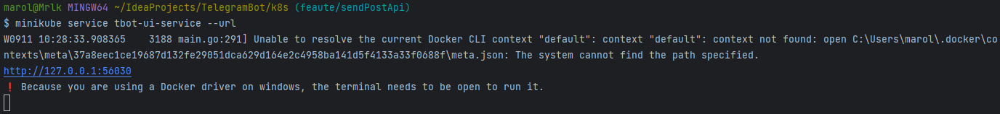

# 🚀 Start application
## 🔗 Links
* [🟢 Spring Boot application](#-spring-boot-application)
* [🚢 Docker compose](#-docker-compose)
* [☸️ Kubernetes](#-kubernetes)
* [🚧 WIP 🏗️ Start with JKube Maven Plugin - **⚠️NOT WORK⚠️**](#-wip--start-with-jkube-maven-plugin-not-work)

## 🟢 Spring Boot application (only TBotWorker (REST API + cache))
* Install min JDK 17 - https://adoptopenjdk.net/
* Set environment in [application-local.yml](../TBotWorker/src/main/resources/application-local.yml):
    - `application.bot.token` - Telegram Bot token
    - `application.bot.directory.path` - local directory for download files
    - `application.bot.admin.id` - admin ID for post (Use [IDBot](https://t.me/username_to_id_bot) for receive id.)
    - `application.group.chat.id` - chat ID for post (Use [IDBot](https://t.me/username_to_id_bot) for receive id.)
    - `application.group.chat.textLine` - last line for caption
* Build and start project
    - IDEA - start `Main.main()`
    - Maven
        1) Compile jar:
        ```bash 
        mvn clean install -U 
        ```
        2) Start app:
        ```bash
        java -jar ./target/TelegramBot*.jar
        ```
    - Test API
      - Swagger (OpenAPI)
        - http://localhost:8080/webjars/swagger-ui/index.html
        - http://localhost:8080/v3/api-docs
      - Actuator
        - http://localhost:8080/actuator
* Integration test (need [Docker](https://www.baeldung.com/ops/docker-compose))
  * End steps [🚢 Docker compose](#-docker-compose)
  * Set `test.integration.config.ssh.path` in [application-test.properties](../TBotITest/src/test/resources/application-test.properties)
    ```bash 
    mvn clean install -U -P build_with_it_test
    ```

## 🚢 Docker compose
* [Start info](https://www.baeldung.com/ops/docker-compose)
* For build TBotUI
   * Install nvm - [Windows](https://github.com/coreybutler/nvm-windows), [Linux](https://github.com/nvm-sh/nvm)
   * Install Node
      ```bash
      nvm install 16.13.1 64
      nvm use 16.13.1
      ```
   * Init `npm` in **TBotUI** module
      ```bash
      npm install
      ```
* Create dir `docker_files` and download JDK 17 (or JRE)
* Update `ADD` in [Dockerfile](../TBotUI/Dockerfile) for TBotUI
    * Example: `ADD docker_files/jdk_17_x64_alpine.tar.gz /opt/app/java`
* Set JDK in `CMD` for start application
    * Example: `/opt/app/java/jdk-17.0.8+7-jre/bin/java`
* Build JAR -
    ```bash
    mvn clean install -U
    ```
* Set environment in [.env](../.env)
    - `LOCAL_PC_MOUNT_DIR` - local directory for download files
* Set ENV in [docker-compose](../docker-compose.yml)
    - `tbotconf.GIT_URL` - your Git config (more [Spring Cloud Config](https://docs.spring.io/spring-cloud-config/docs/current/reference/html/))
    - `tbotconf.PRIVATE_KEY` - use SSH private key for connect (example [GitHub](https://docs.github.com/en/authentication/connecting-to-github-with-ssh/adding-a-new-ssh-key-to-your-github-account))
* Set config in your Git repo ([TelegramConf](https://github.com/PavelBocharov/TelegramConf/blob/main/telegram-bot-image.yml), example [YAML](../TBotWorker/src/main/resources/example.yaml))
* Start
     ```bash
     docker compose up
     ```
* Stop
     ```bash 
     docker compose down
     ```

## ☸️ Kubernetes
* ⚠️Kubernetes work with image in [Docker HUB](https://hub.docker.com/repositories/marolok)⚠️
* Install Kubernetes(Minikube) - **[LINK](https://kubernetes.io/ru/docs/setup/learning-environment/minikube/)**
* Start Minikube
    * First start
        * Mount dir - *"D:/temp/k8s"* your PC directory for TelegramBot data and PostgreSQL.
          ```bash
          minikube start --mount-string="D:/temp/k8s:/mnt/tbot" --mount
          ```
        * Add Ingress
          ```bash
          minikube addons enable ingress
          ```
    * Other command
        * Start minikube (mount is automatic)
          ```bash
          minikube start
          ```
        * Stop minikube
          ```bash
          minikube stop
          ```
        * Delete all data and minikube
          ```bash
          minikube delete
          ```
        * Start and open Kubernetes WebUI
          ```bash
          minikube dashboard
          ```

### 📗 Start with YAML
* Build and push docker images
  * Plugin
    ```bash
    cd ../
    mvn clean install -U -P build_with_it_test
    mvn docker:build docker:push -P build_docker_images
    ```
  * CMD (in root module)
    ```bash
    docker build -t marolok/telegram_bot:*.*.* .
    docker push marolok/telegram_bot:*.*.*
    ```
* Set environment in [kube_conf.yaml](../k8s/kube_config.yaml) - check _"TelegramConf"_ block
    * `BOT_PROFILE` - application profile (need for application config filename, [Spring Cloud Config](https://docs.spring.io/spring-cloud-config/docs/current/reference/html/))
    * `GIT_URL` - your Git config (more [Spring Cloud Config](https://docs.spring.io/spring-cloud-config/docs/current/reference/html/))
    * `PRIVATE_KEY` - use SSH private key for connect (example [GitHub](https://docs.github.com/en/authentication/connecting-to-github-with-ssh/adding-a-new-ssh-key-to-your-github-account))
* Init config
  ```bash
  kubectl apply -f ./k8s/kube_config.yaml
  ```
* Init PersistentVolume & PersistentVolumeClaim
  ```bash
  kubectl apply -f ./k8s/kube_pv.yaml
  ```
* Deploy pods
  ```bash
  kubectl apply -f ./k8s/kube_pod.yaml
  ```
* Ingress config
  ```bash
  kubectl apply -f ./k8s/kube_ingress.yaml
  ```
    * Get application URL
      ```bash
      minikube service tbot-ui-service --url
      ```
  
